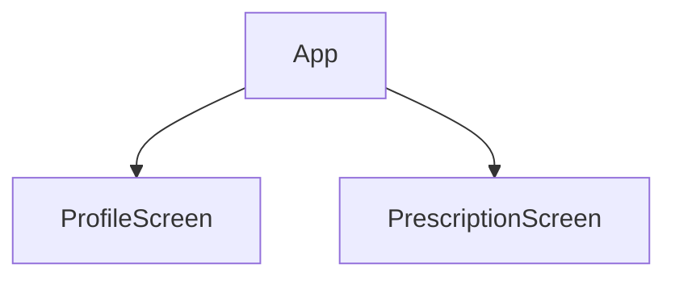

# ProfileBare Coding Interview

Our team is building a new react-native app for our clients that they can use to view information about their account on-file. Our product team has asked for an MVP with some basic features that allow users to see a bit of profile information. This MVP will be used to:

- Ensure the app can communicate with existing endpoints
- Allow the engineering team to establish a foundation for future features

This repo outlines the features that our product team requirements in the form of Jest tests. The test names show what we need to build, but the tests and features themselves are incomplete.

The app has 1 container that switches between 2 screens using a `setScreen` function passed as props:

## Prescription Feature

The Prescription feature consists of a new `PrescriptionScreen` that:

- Shows how many active prescriptions a user has
- Lists out the names of the prescriptions
- Shows button that allows a user to return back to their profile

In `src/prescription`, there is 1 passing test and 3 other failing tests.

Our job will be to complete the tests and build the code to ensure they’re passing.
